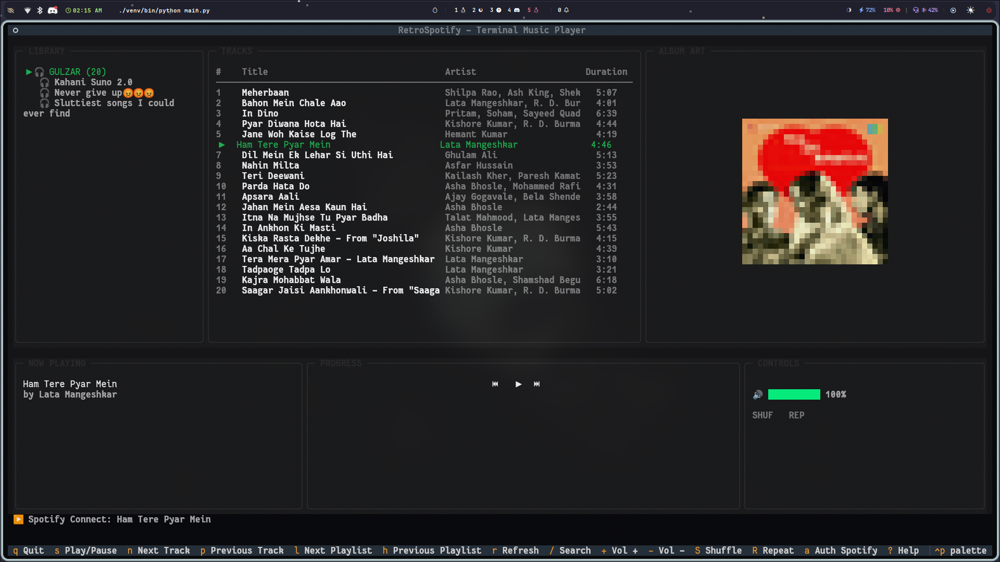

# 🎵 RetroSpotify

**RetroSpotify** is a terminal-based Spotify client built with Python and Textual. It brings your music to the command line with a retro aesthetic, ASCII album art, and full playback control via Spotify Connect.



## ✨ Features

-   **Terminal UI**: A beautiful, responsive TUI (Text User Interface) powered by Textual.
-   **Spotify Connect**: Control playback on your Desktop, Phone, or Smart Speaker directly from the terminal.
-   **ASCII Album Art**: Real-time conversion of album covers to ASCII art.
-   **Liked Songs**: Access your "Liked Songs" library instantly.
-   **Search**: Search for tracks directly from the app.
-   **Volume Control**: Adjust playback volume with keyboard shortcuts.
-   **Mock Mode**: Works offline with synthetic audio for testing UI without Spotify credentials.

## 🚀 Installation

### Prerequisites

-   Python 3.8+
-   A Spotify Account (Premium recommended for full playback control).
-   **Audio Player** (Optional, for local preview playback): `vlc` (recommended), `ffmpeg`, or `mpg123`.

### Setup

1.  **Clone the repository**:
    ```bash
    git clone https://github.com/vaibhav-rm/Spotify-textual.git
    cd Spotify-textual
    ```

2.  **Create a Virtual Environment**:
    ```bash
    python3 -m venv venv
    source venv/bin/activate
    ```

3.  **Install Dependencies**:
    ```bash
    pip install -r requirements.txt
    ```

4.  **Spotify Configuration**:
    RetroSpotify features a built-in **Welcome & Authentication Screen** that guides you through connection:
    1.  Go to the [Spotify Developer Dashboard](https://developer.spotify.com/dashboard/).
    2.  Create a new app. Set the **Redirect URI** to `http://127.0.0.1:8888/callback`.
    3.  Launch RetroSpotify (`python main.py`).
    4.  Select **Quick Login (PKCE)**. You will only need your **Client ID** (no client secret required!).
    5.  The app will open your web browser to authorize access. Once approved, you will be automatically logged in and your details will be saved locally.

    *Alternatively, you can still populate a `.env` file manually:*
    ```env
    SPOTIPY_CLIENT_ID=your_client_id_here
    SPOTIPY_REDIRECT_URI=http://127.0.0.1:8888/callback
    ```

## 🎮 Usage

Run the application:

```bash
source venv/bin/activate
python main.py
```

### Controls

| Key | Action |
| :--- | :--- |
| `Space` / `s` | Play / Pause |
| `n` | Next Track |
| `p` | Previous Track |
| `S` | Toggle Shuffle |
| `R` | Toggle Repeat |
| `/` | Search Tracks |
| `+` / `-` | Volume Up / Down |
| `l` | Next Playlist |
| `h` | Previous Playlist |
| `a` | Go to Authentication Screen |
| `r` | Refresh Data |
| `q` | Quit |
| `?` | Help |

## 🖱️ Mouse Support

-   **Click** on a track to play it.
-   **Click** on a playlist to select it.

## 🛠️ Troubleshooting

-   **"No active Spotify device"**: Open Spotify on your computer or phone and play a song to wake it up. RetroSpotify acts as a remote control.
-   **"No audio" (Mock Mode)**: Ensure you have `ffplay` (ffmpeg) installed to hear synthetic tones.
-   **Album Art not showing**: Ensure `Pillow` is installed (`pip install Pillow`).

## 📜 License

MIT
